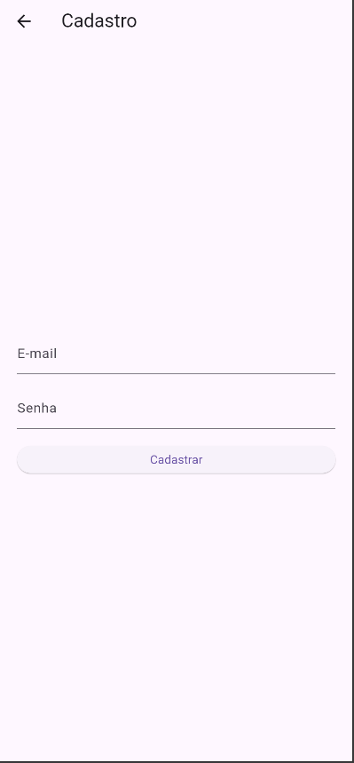
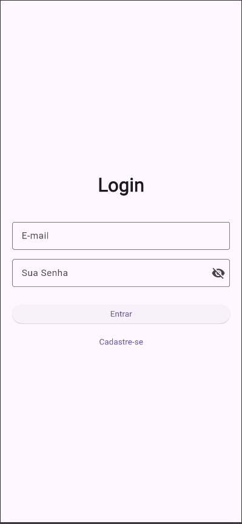
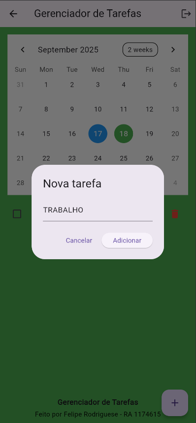
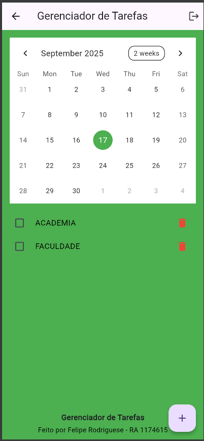
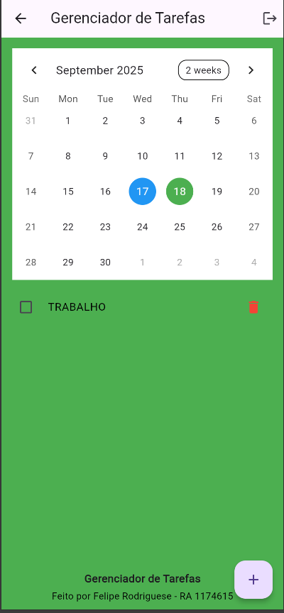

# 📌 Gerenciador de Tarefas  

Aplicativo desenvolvido em **Flutter** com integração ao **Firebase**, permitindo que usuários se cadastrem, façam login e gerenciem suas tarefas de forma prática.  

Este projeto foi desenvolvido como parte da disciplina **Desenvolvimento para Dispositivos Móveis**, do curso de **Análise e Desenvolvimento de Sistemas** da **Uniube**.  

## Imagens do Projeto

 

## 📱 Funcionalidades  

- Cadastro de usuários com Firebase Authentication  
- Login com validação de e-mail e senha  
- Exibição de mensagens de erro em tempo real (SnackBar)  
- Listagem de tarefas por usuário com **Cloud Firestore**  
- Adição e remoção de tarefas  
- Marcação de tarefas como concluídas  
- Integração com **TableCalendar** para visualizar datas  

## 🛠️ Estruturas utilizadas  

- **Formulários e validações** com `Form` e `TextFormField`  
- **Controle de estado** (`setState`) para loading e visibilidade da senha  
- **Autenticação com Firebase** (`signInWithEmailAndPassword` e `createUserWithEmailAndPassword`)  
- **Tratamento de exceções** com `try/catch`  
- **Rotas nomeadas** para navegação (`Navigator.pushNamed`)  
- **Listas dinâmicas** (`ListView` e `ListTile`) para exibição de tarefas  
- **Streams** com `StreamBuilder` para atualização em tempo real  
- **Calendário** com `TableCalendar` para seleção de datas  

## 🚀 Tecnologias  

- [Flutter](https://flutter.dev/)  
- [Firebase Authentication](https://firebase.google.com/products/auth)  
- [Cloud Firestore](https://firebase.google.com/products/firestore)  
- [TableCalendar](https://pub.dev/packages/table_calendar)  

## 📂 Estrutura do Projeto 
lib/
├── main.dart # Ponto de entrada do app
├── login_page.dart # Tela de login
├── cadastro_page.dart # Tela de cadastro
├── home_page.dart # Tela principal (tarefas)
└── firebase_options.dart # Configuração Firebase

Projeto desenvolvido por Felipe Rodrigues

